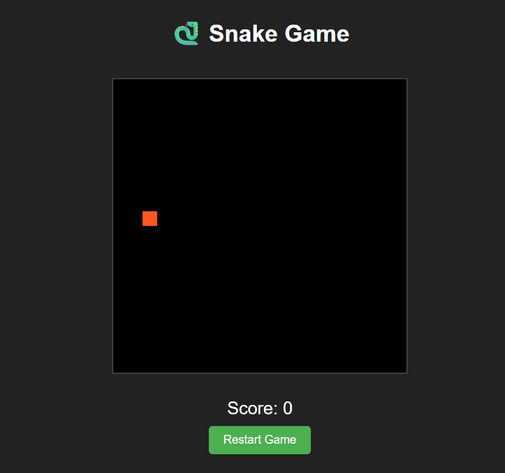

# 🐍 Python Snake Game with Pygame

A simple yet classic Snake game implementation using Python and Pygame library. Perfect for beginners learning game development or Python programming.

 

## Features

- 🕹️ Classic Snake gameplay mechanics
- 🎨 Simple and clean visual interface
- 📊 Score tracking
- 🔄 Game over detection and restart option
- ⚙️ Configurable game settings (speed, grid size)
